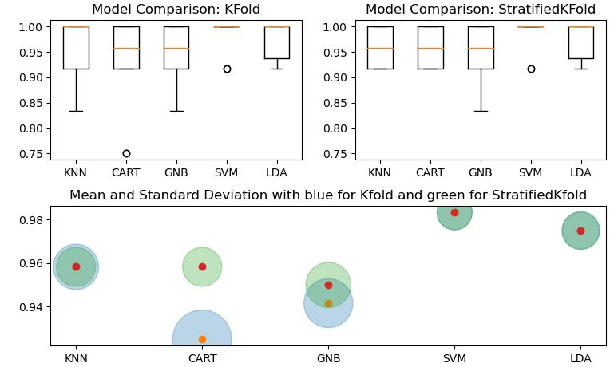
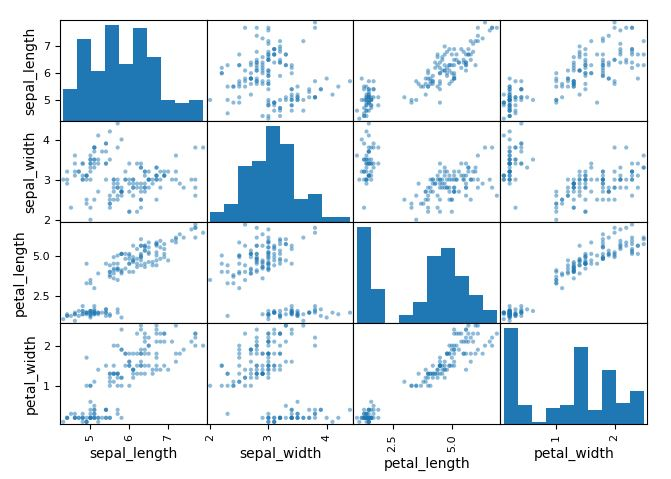
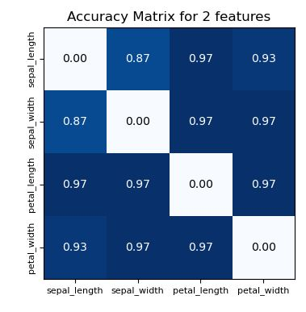
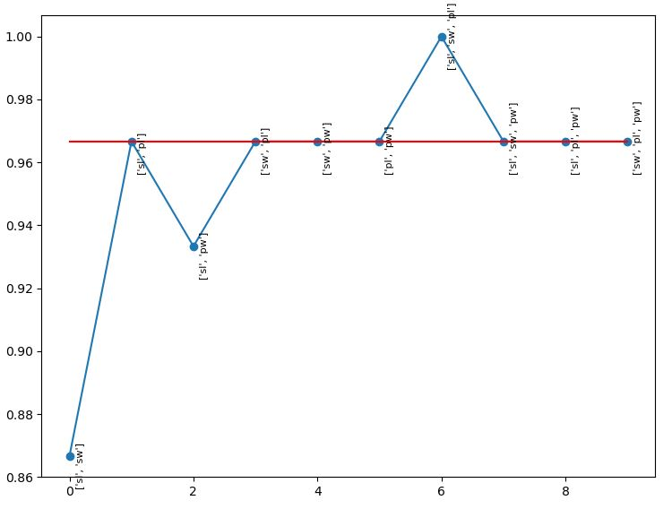

# Iris-Data-Classification
  This is my first program with Python using Machine Learning. Here, I try to compare multiple models and find Support Vector Classifier work the best.
 
 Comparing Model for Kfold Cross-validation technique and StratifiedKfold Cross-validation Technique.
 Both are sampling techniques, and the only difference is StratifiedKfold is representative of the distribution of the dataset, whereas Kfold is a random sampling technique.
 
 
 
 <b> Feature Selection
 Using Scatter-Matrix, I try to get an understanding of correlation between features taking 2 at a time.
 
 
 
 Accuracy Matrix for predicting the class/label with 2 Features at a time 
 
 
 
 Accuracy of 2 or 3 features in predicting the class/label
 
 
 
 
